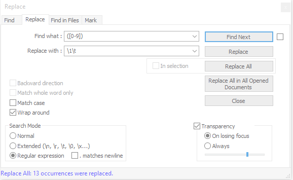
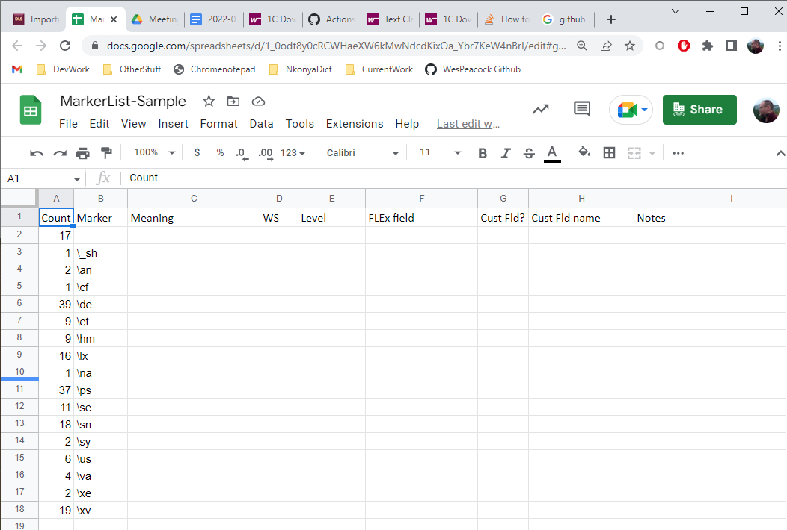

# 2C Enumerate the markers
## Make a list of all the markers
On a Linux system, you can get the marker list with a command line expression:
```bash
cat filename.db | sed -e "s/ .*$//" | sort | uniq -c > sfm-list.txt   or dos2unix < filename.db | sed -e "s/ .*$//" | sort | uniq -c > sfm-list.txt
```
[Note: in the **sed** command, there is a space before the .* , and there is no space in the // part of the command]

- The result will be a file called **sfm-list.txt** with a list of all the SFMs and a count of how many times each occurs.

Open that file in **Notepad++**.
- Use search/replace to change the space between the counts and the markers into a tab, so this file will be tab-delimited (and easier to paste into Excel): 
- Tick "Regular Expressions"
- Find: "([0-9]) " (don't type the quotes, and be sure there is a space at the end) [This finds a single digit followed by a space, and captures only the digit to use in the replacement string.]
- Replace: "$1\t" (with no quotes)  [This puts in the item that was captured in the Find (the single digit that occurs before a space) followed by a tab.]
- The result should be two columns separated by a tab.

[There is also a way to do it with "Convert text to table" in Word that doesn't require the regular expression search/replace operation.]

## Make a chart to document the markers
It is helpful to have a spreadsheet to record what you have figured out about the markers.  It will be helpful to have one column for each piece of information you need about each marker.  These items include:
- A count of the marker
- The marker itself
- Its meaning or purpose
- What writing system it uses
- What level of the hierarchy it belongs to (Entry, Sense, Example, other)
- What field in FLEx you expect to map it into
  - If it needs a custom field: name of field, level of hierarchy, writing system(s)
- Notes about things you need to investigate

If you made a list of the markers (e.g., sfm-list.txt) in the previous step, you should be able to paste it into a spreadsheet, and the counts will go in the first column, and the markers in the second.  Then you can add row headers for each of the items listed above.

Below is a sample of such a spreadsheet, with only the row headers filled in.


## Determine the meaning of each
- Make your best guess about the meanings of each of the markers.  If they are standard MDF markers, start with the default MDF meaning.
- For markers you don't know, you can either look at their contents and make a best guess, or you can just make a list, so you can ask the linguist.
- There may also be markers that are standard MDF markers, but used for a different purpose.  Keep an eye out for that.
- After you have made your best guess about the meaning of each, you could send the spreadsheet to the linguist and ask them to correct any wrong guesses, and fill in the parts you weren't able to figure out.  (It may be good to complete the following items in the spreadsheet as well, before sending it to the linguist.)

## Determine which writing system each uses
 - For many markers, it will be obvious what writing system they are using.  It is helpful to go ahead and fill these in on the spreadsheet.
 - If there are any you are uncertain of, make a note to ask the linguist.
 - Pay attention to whether the data only uses one vernacular WS and one analysis WS, or if there is also phonetic data, or glosses/examples in more than one analysis WS.  There may also be reversal entries in more than one language, even if glosses/examples only use one.
## Determine the level in the hierarchy
 - In the spreadsheet, indicate for each field whether it occurs at the Entry level, Sense level, or another level of the hierarchy (e.g., Example, Pronunciation, Etymology).
 - Some markers are obvious.  For any that are not, explore the database to see what occurs.  If a marker occurs at both Sense level and Entry level, make a note that you will have to adjust it.  You will either need to move some of those fields to the correct location in the entry, or you will need to introduce additional markers.  For instance, if the marker \co is used at both the Entry and Sense level, and you determine that there are valid reasons for that, then you might want to change all occurrences of \co into either \coLX or \coSN, for entry and sense levels respectively.
 - Later in the process, it would be good to use a tool like Solid to be sure that all Entry level markers are indeed at the Entry level, and Sense level markers at the Sense level, etc.  For now it is enough to make a note on the spreadsheet about your best guess, or where it ought to be.
 - You can also make a note about any that need particular investigation or cleanup.

## Determine what custom fields are needed
 - If a marker in the database doesn't correspond to a built-in field in FLEx, make a note in the spreadsheet that it will need a custom field.
 - Decide on a good name for the field you will make.
 - Be sure you have filled in the columns for what writing system(s) this field needs, and what level in the hierarchy it will occur at.
 - At a later step, you will create all these custom fields in the empty database, and then make a backup before doing the import.
 - You may do that iteratively--add some custom fields, make a backup of the empty database with the newly added custom fields, attempt an import, and then realize you need still more custom fields, and repeat the process.  That is a normal part of an import process.
